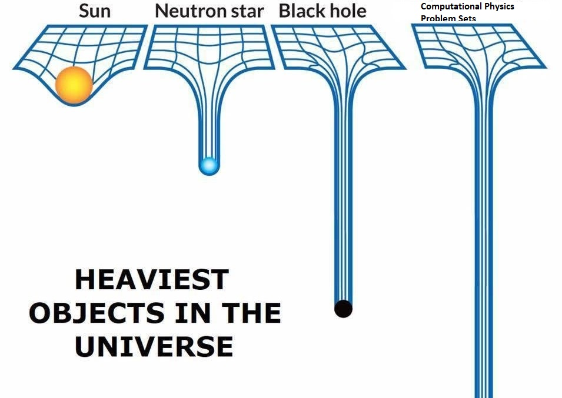

# PHYS514_Project
 The term project of the Computational Physics (PHYS514) course. -- Koc University

# TL&DR

All project-related deliverable scripts/reports are collected under *scripts* [folder](https://github.com/vaydingul/PHYS514_Project/tree/main/scripts).

**It is recommended to read the [project report](https://github.com/vaydingul/PHYS514_Project/tree/main/scripts/ps_report.pdf) before observing the visualization scripts.**

There is a script called [main.py](ttps://github.com/vaydingul/PHYS514_Project/tree/main/scripts/main.py) which demonstrates the experiments conducted on *Newtonian approach* and *Relativistic approach*. This script basically calls the function called *demo()* in each individual script in the same folder. The input arguments that can be passed to each individual *demo()* function can be observed in their parent scripts.

# General Folder Structure

## *src*

It contains the all required custom module implementations that are used in the project. The spesific properties of the modules can be observed below:

**[Utils.py](https://github.com/vaydingul/PHYS514_Project/tree/main/src/Utils.py)** : It includes the all helper functions and unit conversion/transformation related functionalities.

**[Plotter.py](https://github.com/vaydingul/PHYS514_Project/tree/main/src/Plotter.py)** : It is a higher level wrapper for the *matplotlib* which makes it easier to plot figures which includes more than one data vector.

**[Constants.py](https://github.com/vaydingul/PHYS514_Project/tree/main/src/Constants.py)** : It is just a collection of the constants that are used in throughout the study.

**[Solvers.py](https://github.com/vaydingul/PHYS514_Project/tree/main/src/Solvers.py)** : Undoubtlessly, it is the most important package in the repository. It includes all the routines that enables solution of the ODEs in the project. Moreover, it includes all the functionality that implements numerical methods on the data.

## *data*

It contains the *White Dwarf (WD)* data that is used in numerical calculations.

## *test*

It includes the unittests for the functions located in [Utils.py](https://github.com/vaydingul/PHYS514_Project/tree/main/src/Utils.py), and also, it includes the timing/performance tests for some of the methods that are present in the [main scripts](https://github.com/vaydingul/PHYS514_Project/tree/main/deliverables-scripts).

## *report*

It includes the materials (figures, and LaTeX code) that are required for the construction of the study report.

## *wolfram_nb*

It includes *Wolfram Mathematica* notebooks that are used for the analytical solution of the some of the problems.